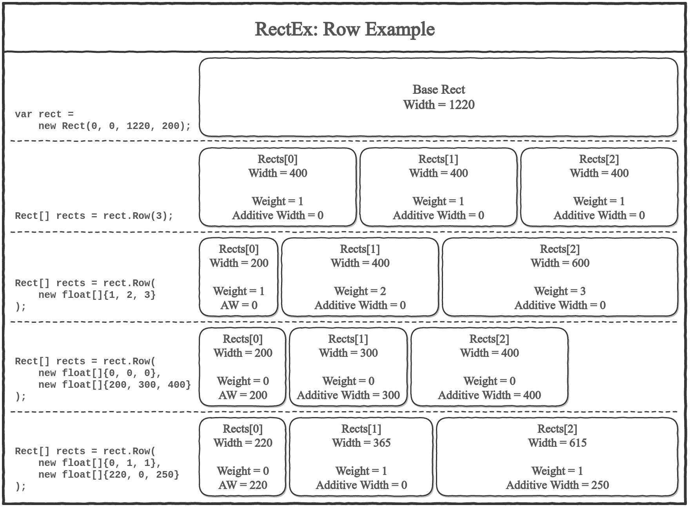
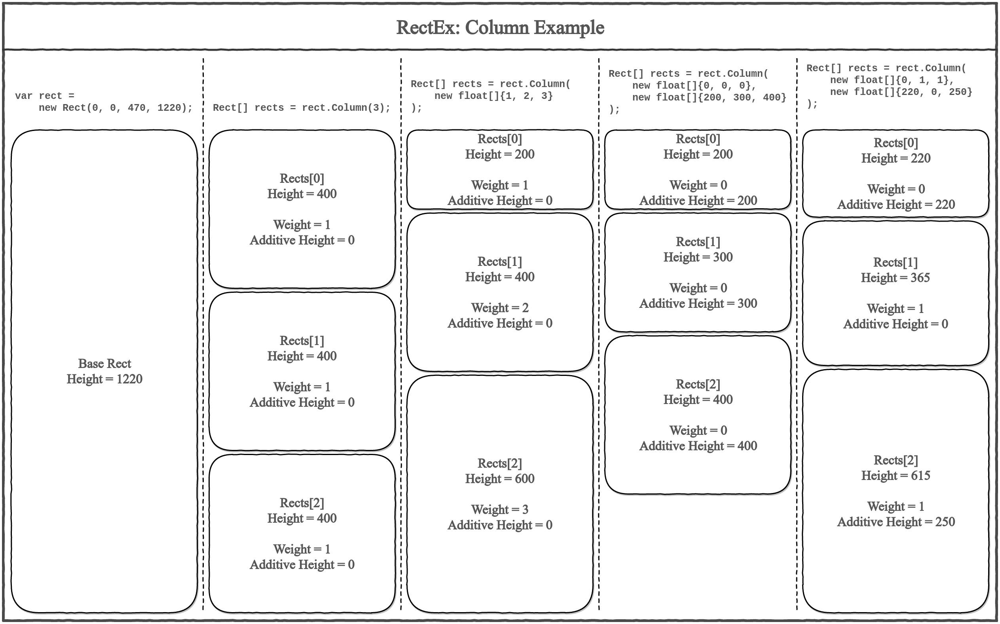
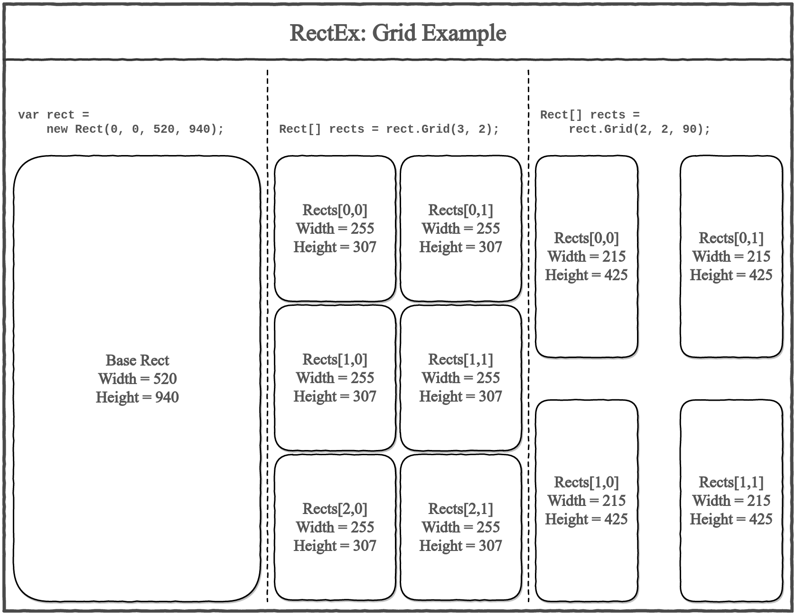
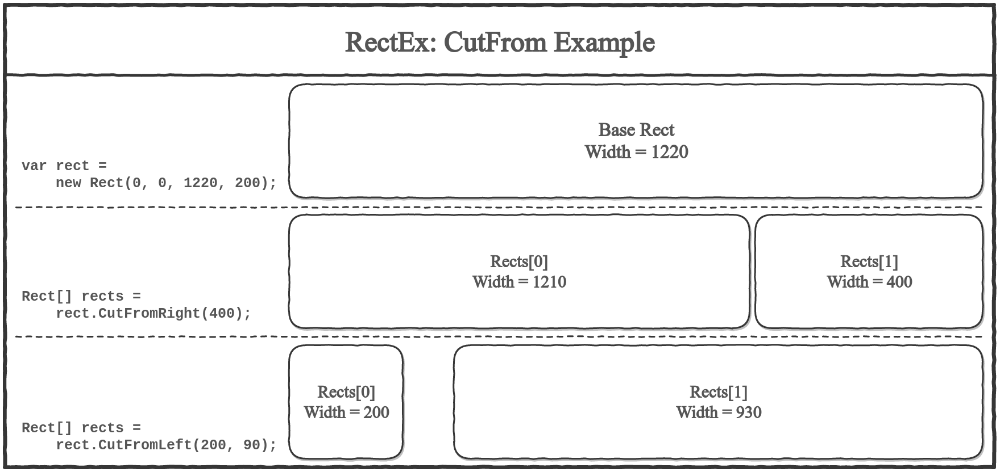
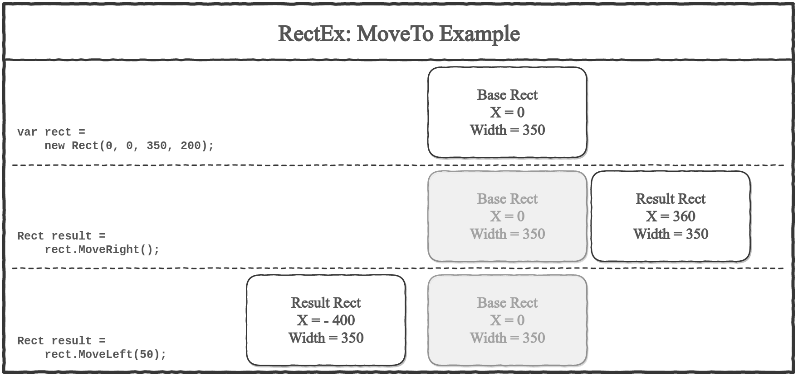
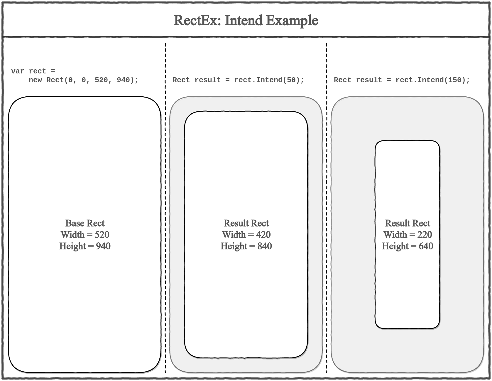
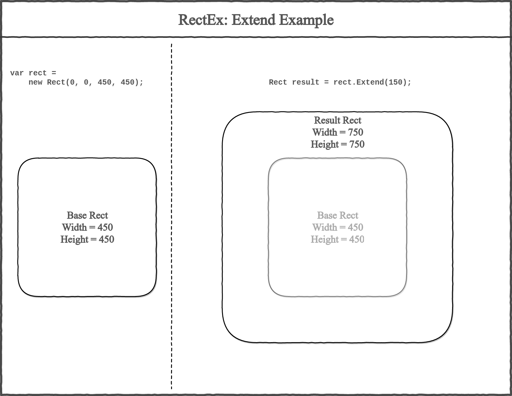
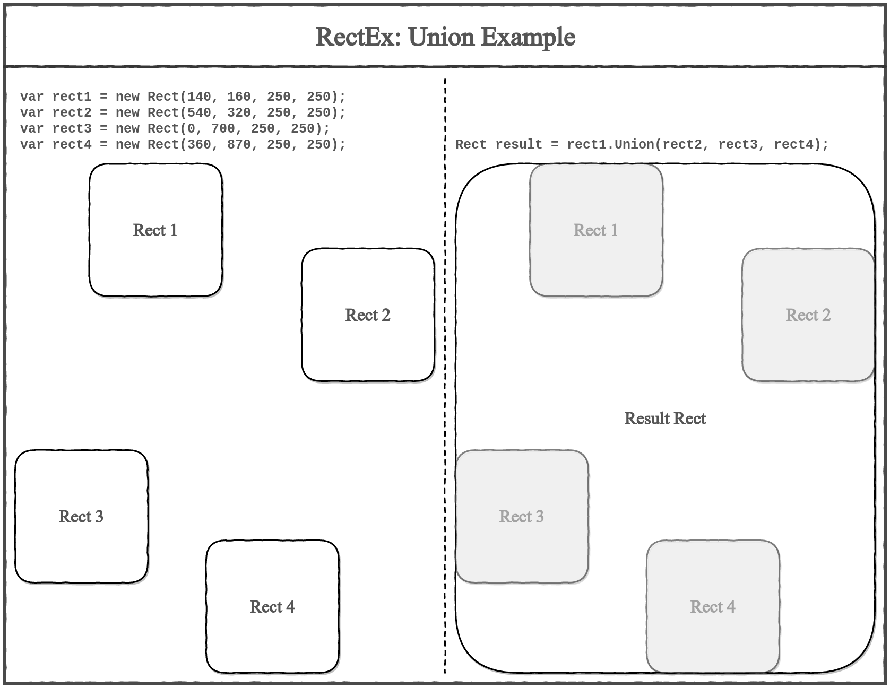
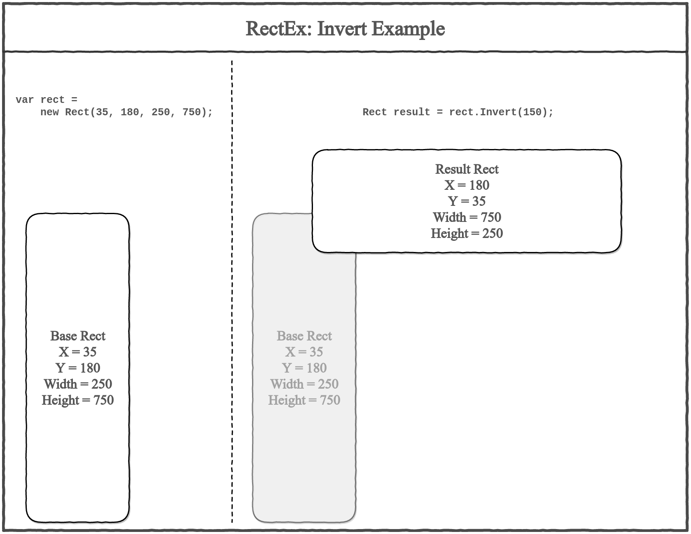
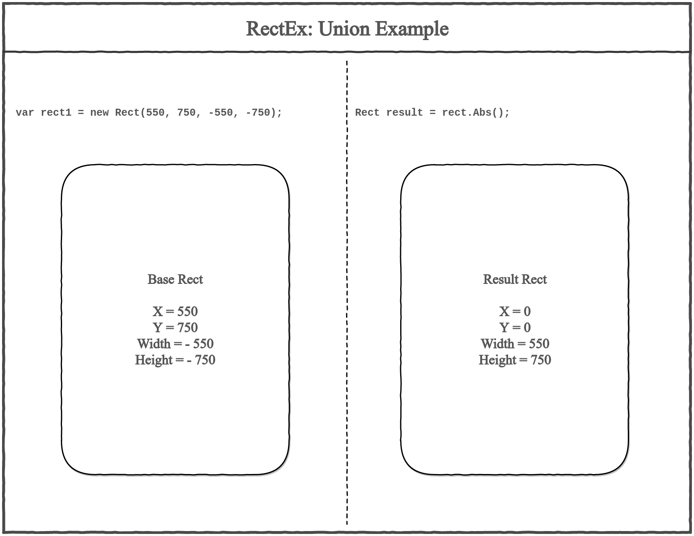

# How to use it?

First of all, add *using* statement:

```csharp
using RectEx;
```

There are two base methods:
* `rect.Column(...)` -- slices your rect into an array of horizontal lines.
* `rect.Row(...)` -- slices your rect into an array of vertical lines.

There are many other methods in RectEx, but Column and Row are the most useful.

Both of them provide two variants of usage:
* pass to method an integer **count** of slices to get an array of equal pieces;  
  For example, `rect.Raw(5);` returns a row of 5 equal cells;
* pass to method an array of floats to get an array of weighed pieces.  
  For example, `rect.Raw(new float[]{1,5})` returns two cells: the small one and the big one.

Look at the tests. Tests are the best docs. But if you don't want to read code, read below.

# What methods does it provide?

* [Row](#row)
* [Column](#column)
* [Grid](#grid)
* [CutFrom](#cutfrom)
* [FirstLine](#firstline)
* [MoveTo](#moveto)
* [MoveToFor](#movetofor)
* [Intend](#intend)
* [Extend](#extend)
* [Union](#union)
* [Invert](#invert)
* [Abs](#abs)

## Row

Slices rect with a vertical separators. Returns an array of pieces.

There are two variants: you may pass to `Row` count of pieces or their relative weights (with additive widthes).

```csharp
Rect[] Row(this Rect rect, int count, float space = DEFAULT_SPACE);
Rect[] Row(this Rect rect, float[] weights, float space = DEFAULT_SPACE);
Rect[] Row(this Rect rect, float[] weights, float[] widthes, float space = DEFAULT_SPACE);
```



## Column

Slices rect with a horizontal separators. Returns an array of pieces.

There are two variants: you may pass to `Column` count of pieces or their relative weights (with additive heights).

```csharp
Rect[] Column(this Rect rect, int count, float space = DEFAULT_SPACE);
Rect[] Column(this Rect rect, float[] weights, float space = DEFAULT_SPACE);
Rect[] Column(this Rect rect, float[] weights, float[] heights, float space = DEFAULT_SPACE);
```



## Grid

Slices rect with a horizontal and vertical separators. Returns a 2d array of pieces (Rect[,])

There are two ways: you may pass a size of grid or separated counts of rows and columns.

```csharp
Rect[,] Grid(this Rect rect, int size, float space = DEFAULT_SPACE);
Rect[,] Grid(this Rect rect, int rows, int columns, float space = DEFAULT_SPACE);
Rect[,] Grid(this Rect rect, int rows, int columns, float spaceBetweenRows, float spaceBetweenColumns);
```



## CutFrom

Section CutFrom consists of four methods: CutFromRight, CutFromLeft, CutFromTop and CutFromBottom.

CutFrom cuts a piece from one of four directions. Returns an array of two pieces: the cut and the rest.

You can use `Row` and `Column` to get the same but CutFrom is easier, faster and  more readable.

```csharp
Rect[] CutFromRight(this Rect rect, float width, float space = DEFAULT_SPACE);
Rect[] CutFromLeft(this Rect rect, float width, float space = DEFAULT_SPACE);
Rect[] CutFromBottom(this Rect rect, float height, float space = DEFAULT_SPACE);
Rect[] CutFromTop(this Rect rect, float height, float space = DEFAULT_SPACE);
```



## FirstLine

Method FirstLine is a sugar for `rect = rect.CutFromTop(height, 0)[0]`. 

I noticed that I often use that construction so I just add FirstLine method to simplify my code.

Threr is no _space_ because it returns single rect. 

```csharp
Rect FirstLine(this Rect rect, float height = 18);
```

I use FirstLine in this way:

```csharp
rect = rect.FirstLine(18);
// Draw first line
rect = rect.MoveDown();
// Draw second line
rect = rect.MoveDown();
// Draw third line
```

## MoveTo

Section MoveTo like CutFrom consists of four methods: MoveRight, MoveLeft, MoveUp, MoveDown.

MoveTo moves rect per its width/height. As same as using `rect.y += rect.height;`. Returns a rect.

```csharp
Rect MoveRight(this Rect rect, float space = DEFAULT_SPACE);
Rect MoveLeft(this Rect rect, float space = DEFAULT_SPACE);
Rect MoveBottom(this Rect rect, float space = DEFAULT_SPACE);
Rect MoveTop(this Rect rect, float space = DEFAULT_SPACE);
```



## MoveToFor

Section MoveToFor is like MoveTo, but allows you to specify size of step.

MoveToFor moves rect per specified step. As same as using `rect.y += step;`. Returns a rect.

```csharp
Rect MoveRightFor(this Rect rect, float step, float space = DEFAULT_SPACE);
Rect MoveLeftFor(this Rect rect, float step, float space = DEFAULT_SPACE);
Rect MoveBottomFor(this Rect rect, float step, float space = DEFAULT_SPACE);
Rect MoveTopFor(this Rect rect, float step, float space = DEFAULT_SPACE);
```

~~Sorry, there is no image yet~~

## Intend

Intend creates a border inside rect. Returns a new Rect.

```csharp
Rect Intend(this Rect rect, float border);
```



## Extend

Extend creates a border outside the rect. Returns a new rect.

```csharp
Rect Extend(this Rect rect, float border);
```



## Union

Union creates a new rect, contains all rects you pass. Returns a new rect.

```csharp
Rect Union(this Rect rect, params Rect[] other);
```



## Invert

Invert swaps x with y; width with height. Returns a new rect.

```csharp
Rect Invert(this Rect rect);
```



## Abs

Abs returns the same rect with positive width and height.

```csharp
Rect Abs(this Rect rect);
```



*I see __Union()__ at the top of image. Don't panic! It is just a bug. This is an example of __Abs__ function. Sorry. I will repair it someday.*
