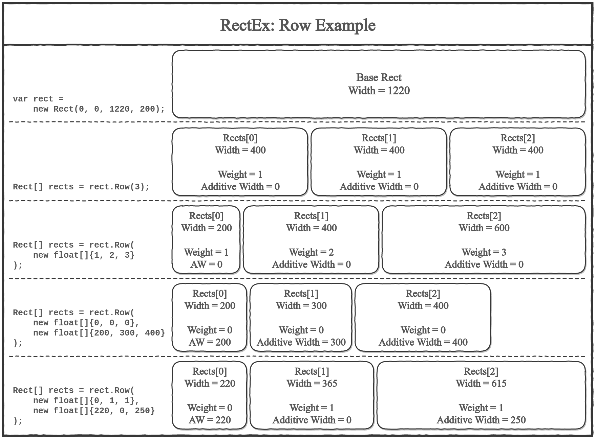
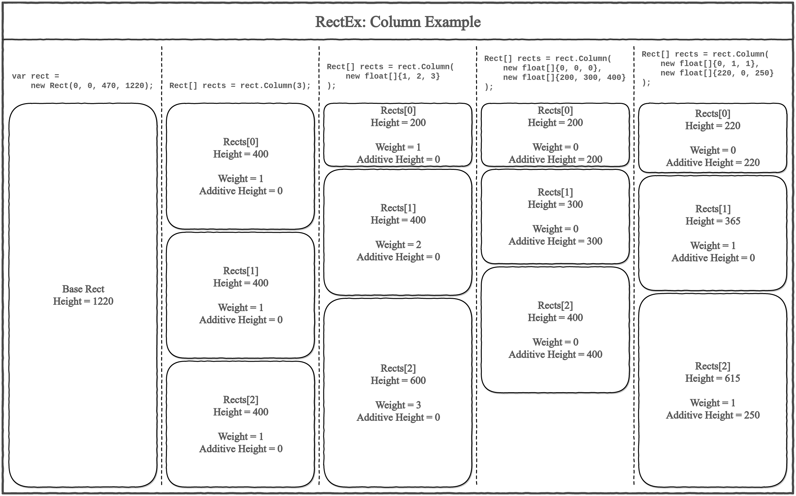

# Overview

RectEx is a tool for slicing Rects in Unity3d. RectEx consists of a few extensions of `Rect` class which provides an interface for simplify operating with rects. 

Stop doing 

```csharp
rect.height = 18;
GUI.LabelField(rect, "First line");
rect.y += rect.height;
GUI.LabelField(rect, "Second line");
rect.y += rect.height;
rect.width = (rect.width - 5) / 2;
GUI.LabelField(rect, "Third line: left part");
rect.x += rect.width + 5;
GUI.LabelField(rect, "Third line: right part");
```

Use **Column** and **Row** instead:

```csharp
var rects = rect.Column(3);
GUI.LabelField(rects[0], "First line");
GUI.LabelField(rects[1], "Second line");

rects = rects[2].Row(2);
GUI.LabelField(rects[0], "Third line: left part");
GUI.LabelField(rects[1], "Third line: right part");
```

RectEx is an Unity3d asset. *But you will not find RectEx in the AssetStore, I'm going to publish it soon.*

# Why do you need it?

Because you don't want to get lost between all these `rect.y += rect.height` and `rect.width = (rect.width - 5) / 2`.

Because you want to draw your GUI elements easy and feel self comfortable.

Because you want to make your code more readable.

Because you can.

# Contributing

If you want to add a bug report or feature request, just add an issue or PR. 

If you create a pull request with new feature or bugfix, please write some tests.

If you see some errors in this text, feel free to fix it.

# How to use it?

First of all, add *using* statement:

```csharp
using RectEx;
```

There are two base methods:
* `rect.Column(...)` -- makes a column from your rect with horizontal lines.
* `rect.Row(...)` -- makes a row with vertical lines.

There are other methods in RectEx, but Column and Row are the most useful.

Both of them provide two variants of usage:
* pass to method integer **count** of slices and it will cut rect into equal pieces;  
  For example, use `rect.Raw(5);` and you will get a row of 5 cells;
* pass to method array of floats and it will cut rect into differet pieces.  
  For example, use `rect.Raw(new float[]{1,5})` and you will get two cells: a small one and a big one.
  
# What methods does it provide?

* [Row](#row)
* [Column](#column)
* [Grid](#grid)
* [CutFrom](#cutfrom)
* [MoveTo](#moveto)
* [Intend](#intend)
* [Extend](#extend)
* [Union](#union)
* [Invert](#invert)
* [Abs](#abs)

## Row

Makes a row based on your rect.

Slices rect with a vertical separators. Returns an array of pieces.

There are two variants: you may pass to `Row` count of pieces or their relative weights. Look at the example.



## Column

Makes a column based on your rect.

Slices rect with a horizontal separators. Returns an array of pieces.

There are two variants: you may pass to `Column` count of pieces or their relative weights. Look at the example.



## Grid

Makes a grid based on your rect.

Slices rect with a horizontal and vertical separators. Returns a 2d array of pieces (Rect[,])

There are only one way: you may pass counts of rows and columns only.

```csharp
var rects = rect.Grid(3, 2, 5);

// Now `rects` is an array Rect[3,2] of equal rects with space = 5 between them.
```

## CutFrom

Section CutFrom consists of four methods: CutFromRight, CutFromLeft, CutFromTop and CutFromBottom.

CutFrom cuts a piece from one of four directions. Returns an array of two pieces: the cut and the rest.

You can use `Row` and `Column` to get the same but CutFrom is easier, faster and  more readable.

```csharp
var rects = rect.CutFromLeft(25, 5);

// Now `rects` is an array of two rects: piece of 25 and the rest.
```

## MoveTo

Section MoveTo like CutFrom consists of four methods: MoveRight, MoveLeft, MoveUp, MoveDown.

MoveTo moves rect per its width/height. As same as using `rect.y += rect.height;`. Returns a rect.

```csharp
rect = rect.MoveDown(space);

// The same as rect.y += rect.height + space; but looks better.
```

## Intend

Intend creates a border inside rect. Returns a new Rect.

```csharp
rect = rect.Intend(1);

// Now rect becomes smaller
```

## Extend

Extend creates a border outside the rect. Returns a new rect.

```csharp
rect = rect.Extend(1);

// Now rect becomes bigger
```

## Union

Union creates a new rect, contains all rects you pass. Returns a new rect.

```csharp
var rect = rect1.Union(rect2, rect3, rect4);

// Now rect contains rect1, rect2, rect3, rect4.
```

## Invert

Invert swaps x with y; width with height. Returns a new rect.

```csharp
var inverted = rect.Invert();

// Now inverted.x == rect.y, inverted.height == rect.width, etc
```

## Abs

Abs returns the same rect with positive width and height.

```csharp
var abs = rect.abs();

// Now abs.width >= 0 and abs.height >= 0, but abs == rect.
